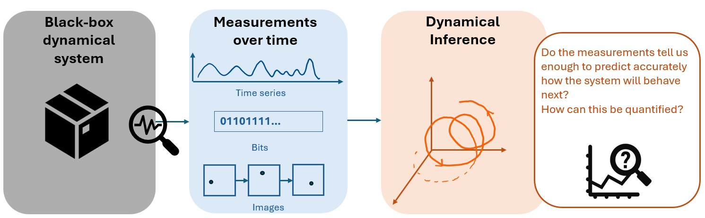

# Quantifying observability through predicatibility
# 


## Predictability and Observability in Multivariate Time Series

This project uses multivariate time-series forecasting to study a practical question:

> Do the available measurements contain enough information to predict the future behavior of a dynamical system?

# Predictive Observability

## Testing Measurement Sufficiency Through Multivariate Time-Series Forecasting

Dynamical systems often contain internal variables that cannot be measured directly. This project asks a practical question:

> Do the available measurements contain enough information to predict the future behavior of the system?

We study this question using delay embedding, singular value decomposition (SVD), and three forecasting tests: **self**, **conditional**, and **joint predictability**.

## 1. Measurements

Suppose a system produces one or more measurements over time:

$$
\mathbf y_t = [y_t^{(1)},y_t^{(2)},\ldots,y_t^{(p)}].
$$

These measurements may only provide a partial view of the true physical state. The goal is to determine what can be reconstructed and predicted from the information they contain.

## 2. Embedding: Reconstructing a State from History

A measurement at one instant may not reveal the complete state of the system. Its recent history, however, can contain information about hidden variables such as velocity.

For a selected set of measurements $S$, we construct a history window:

$$
\mathbf h_t^{(S)}=
[\mathbf y_t^{(S)},\mathbf y_{t-1}^{(S)},\ldots,
\mathbf y_{t-m+1}^{(S)}].
$$

Long history windows can be high-dimensional and contain repeated information. We therefore stack the training windows into a history matrix and apply SVD:

$$
H_{\mathrm{train}}=U\Sigma V^{\mathsf T}.
$$

Keeping the first $r$ modes gives a lower-dimensional reconstructed state:

$$
\mathbf z_t=V_r^{\mathsf T}
(\mathbf h_t-\overline{\mathbf h}_{\mathrm{train}}).
$$

The full pipeline is:

```text
measurements over time
        ↓
history windows
        ↓
SVD compression
        ↓
reconstructed state
        ↓
forecast model
        ↓
future prediction
```

If the reconstructed state contains the dynamically relevant information, it should support accurate future prediction.

## 3. Self-Predictability

Self-prediction uses the history of one measurement to predict its own future:

```text
history of yᵢ → future yᵢ
```

This tests how much of a signal's future behavior is contained in its own past.

## 4. Conditional Predictability

Conditional prediction asks whether another measurement provides useful information beyond the target's own history:

```text
history of yⱼ      → future yⱼ
history of yⱼ + yᵢ → future yⱼ
```

The improvement can be measured by

$$
\Delta R^2_{i\rightarrow j}
=R^2_{y_i+y_j}-R^2_{y_j}.
$$

A positive gain means that $y_i$ contains complementary information for predicting $y_j$. It does not, by itself, prove causation.

## 5. Joint Predictability

Joint prediction combines several measurements to predict a shared operational target $q$:

```text
history of q                    → future q
history of q + measurements    → future q
```

This tests whether the available measurements are jointly sufficient for predicting a chosen target at a chosen forecast horizon. Additional candidate measurements can then be added to determine whether they reduce the remaining prediction error.

## 6. Interpreting the Results

- Prediction that improves with additional measurements indicates useful complementary information.
- A plateau as more SVD modes are retained suggests that increasing the reconstructed-state dimension is no longer helpful.
- A plateau that rises after adding a new measurement suggests that relevant information was previously missing.
- Remaining error may reflect measurement noise, model limitations, or genuinely unpredictable dynamics.

The aim is not to prove that the complete physical state is observable. Instead, prediction provides an operational test of whether the available measurement histories are sufficient for a specific target and forecast horizon.

